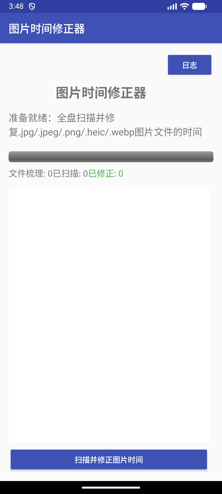

# Android Images time fixer (手机照片时间修正器)

**版本**：0.5.0
**更新时间**：2024-12-01

- **主要开发者**：disminde.lee limingrui 
- **邮箱**：2714845535@qq.com kometo@gmail.com
- **GitHub**：https://github.com/disminde
- 此代码库经disminde.lee limingrui 同意上传，转发或修改请联系开发者

## 项目概述

这是一个Android平台的应用程序，能够自动扫描设备上的所有图片文件，并根据图片的EXIF信息修正文件的创建时间和修改时间，如果没有EXIF相关信息，将通过文件名称综合分析后推测文件形成时间。
当我们从不同设备导入图片或者备份恢复图片时，文件的时间戳常常会丢失原始的拍摄时间，这个应用可以帮助恢复图片的正确时间信息。


<div align="center">
  
</div>

## 功能特点


- 支持**EXIF时间分析**，读取图片的EXIF元数据，根据EXIF时间信息修正文件的创建时间和修改时间
- 支持**文件智能分析**，包括如果EXIF中没有时间信息，将通过文件名称等信息综合分析后推测文件形成时间
     * 1) IMG_20230101_123045.jpg
     * 2) 2023-01-01-12-30-45.png
     * 3) 20230101_123045.webp
     * 4) 2023.01.01.12.30.45.heic
     * 5) 1748512965.jpg

- 自动扫描设备中的所有支持的图片文件（JPG、JPEG、PNG、WEBP、HEIC）
- 提供实时扫描进度反馈
- 支持后台扫描，即使应用在后台也能继续工作
- 兼容Android 5.0（API 21）及以上版本
- 适配Android 11及以上的存储权限变更


## 安装说明

1. 方法1：克隆或下载本项目代码，使用Android Studio. 构建并运行到Android设备或模拟器
2. 方法2：下载已经构建的APK文件，直接安装到Android设备或模拟器

## 使用方法

1. 首次运行应用时，会请求存储权限，请确保授予权限
2. 对于Android 11及以上系统，需要授予"所有文件访问权限"
3. 点击"扫描并修正图片时间"按钮开始扫描
4. 扫描过程中可以查看进度和统计信息
5. 扫描完成后会显示扫描和修正的结果
6. 可以随时点击"停止扫描"按钮中断扫描过程

## 版权信息

© 2023  Android Images time fixer 所有权利保留 

本项目采用MIT许可证


## 联系方式

如有问题或建议，请提交issue或发送邮件至：2714845535@qq.com kometo@gmail.com

## 技术实现

- 使用Java开发，遵循Android最佳实践
- 使用AndroidX ExifInterface库读取图片的EXIF信息
- 采用Service组件进行后台扫描，避免阻塞主线程
- 使用广播机制在Service和Activity之间通信
- 实现前台服务和通知，确保在Android 8.0及以上系统正常运行

## 权限说明

- `READ_EXTERNAL_STORAGE`：读取外部存储中的图片文件
- `WRITE_EXTERNAL_STORAGE`：修改文件的时间戳
- `MANAGE_EXTERNAL_STORAGE`：Android 11及以上需要的管理所有文件权限

## 项目结构

```
app/
├── src/
│   └── main/
│       ├── java/com/imagefixer/app/
│       │   ├── MainActivity.java    # 主界面和用户交互
│       │   └── ScanService.java     # 后台扫描服务
│       ├── res/
│       │   ├── layout/
│       │   │   └── activity_main.xml  # 主界面布局
│       │   ├── values/
│       │   │   ├── colors.xml       # 颜色定义
│       │   │   ├── strings.xml      # 字符串资源
│       │   │   └── styles.xml       # 样式定义
│       │   └── drawable/            # 图片资源目录
│       └── AndroidManifest.xml      # 应用配置和权限声明
├── build.gradle                     # 应用模块构建配置
└── proguard-rules.pro               # ProGuard混淆规则
├── build.gradle                     # 项目级构建配置
├── gradle.properties                # Gradle配置属性
└── README.md                        # 项目说明文档
```

## 注意事项

- 修改大量文件可能需要较长时间，请耐心等待
- 为避免数据丢失，建议在使用前备份重要图片
- 在Android 11及以上系统中，需要手动授予"所有文件访问权限"


